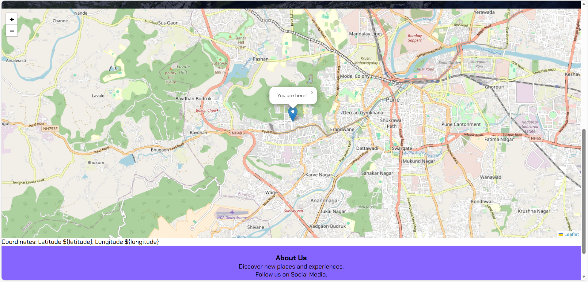
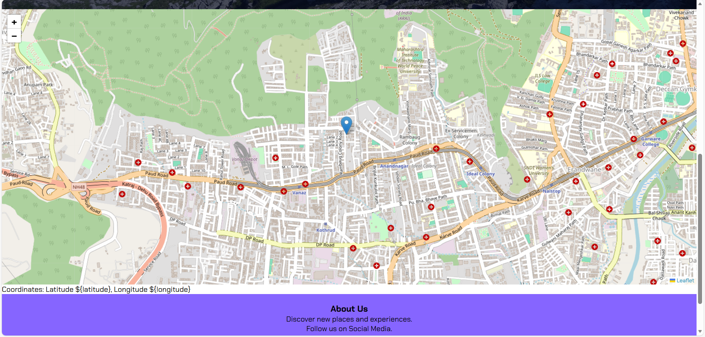
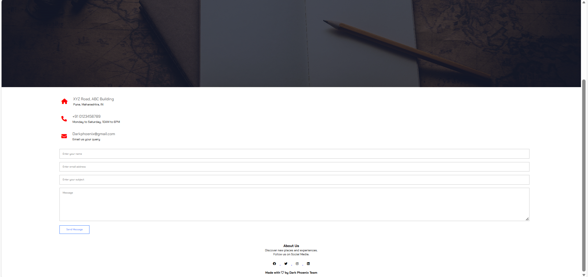

# TourRashtra 🌍

**TourRashtra** is a small web project built to explore tourist places in **Maharashtra** using an interactive map and location-based suggestions.
The main idea behind the project is to make a simple tourism website where users can see nearby locations directly on a map.

Most of the functionality in this project is handled using **JavaScript**, especially for map rendering and location detection.

---

## 🛠 Technologies Used

* **JavaScript** (main functionality)
* **Leaflet.js** – interactive map rendering
* **Geolocation API** – detecting user location
* **OpenStreetMap** – map data provider
* **HTML5**
* **CSS3**

JavaScript is used to dynamically load maps, detect the user's location, and place markers on the map.

---

## ✨ Features

* 📍 Detects user's current location
* 🗺 Displays an interactive map
* 📌 Shows tourist places using map markers
* 📑 Multi-page website (Home, About, Blogs, Contact)
* 📬 Contact page with a simple query form
* 🎨 Clean responsive layout

---

## 📸 Website Preview

### Home Page


---

### Live Location Detection

Shows the user's current location using the **JavaScript Geolocation API**.



---

### Tourist Locations Map

Tourist places displayed using **Leaflet.js markers**.



---

### Contact Page



---

## 📂 Project Structure

```
TourRashtra
│
├── index.html
├── About.html
├── Blogs.html
├── Contact.html
│
├── style.css
├── About.css
├── Blogs.css
├── Contact.css
├── range_slider.css
│
├── range_slider.html
│
├── home.png
├── map-location.png
├── tourist-map.png
├── contact-page.png
│
└── README.md
```

---

## 💻 Running the Project

Clone the repository:

```
git clone https://github.com/yourusername/TourRashtra.git
```

Open the project folder and run:

```
index.html
```

in your browser.

---

## ⚠ Image Folder Setup

The website uses an **Img** folder to store the images used across different pages.

After downloading or cloning the project, make sure the following folder exists inside the main project directory:

```
Img
```

Place the required images inside this folder. The project currently uses the following image files:

```
Img/
│
├── book.jpg
├── logo.png
├── standing.jpg
├── stering.jpg
└── TourRashtra.jpg
```

Example final project structure:

```
TourRashtra
│
├── Img
│   ├── book.jpg
│   ├── logo.png
│   ├── standing.jpg
│   ├── stering.jpg
│   └── TourRashtra.jpg
│
├── index.html
├── About.html
├── Blogs.html
├── Contact.html
├── style.css
└── other files...
```

These images are referenced in the HTML files using paths like:

```
Img/filename.jpg
```

So if the **Img folder is missing or empty**, some images on the website will not load correctly.


## 👨‍💻 Author

**Sairaj Reddy**

---

⭐ If you like the project, feel free to give it a star.
